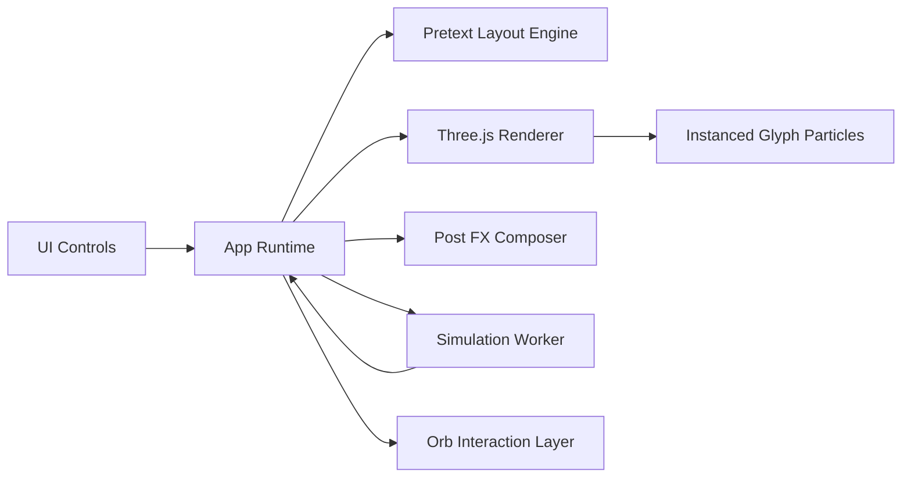

# ORB LETTERS

<p align="center">
  <strong>A living editorial field built with Three.js, GLSL, workers, and Pretext.</strong>
</p>

<p align="center">
  Text does not sit on the page here. It drifts, wraps, compresses, and breathes around moving bodies.
</p>

---

## What It Is

Orb Letters is a real-time kinetic typography piece where text becomes atmosphere.

Three motion orbs act like invisible gravity wells. The paragraph engine continuously reflows copy around them while a particle layer turns language into a luminous field of glyphs. The result sits somewhere between an editorial cover, a generative poster, and a calm sci-fi instrument panel.

This version is intentionally clean: dark by default, minimal UI, and visually driven by motion instead of decorative clutter.

---

## Features

- Real-time text reflow around moving circular bodies
- GPU-instanced glyph particles with custom GLSL shading
- Worker-driven motion field for smooth orb and particle simulation
- Dark-mode-first presentation with light-mode toggle
- Scene modes: `Still`, `Tide`, and `Nova`
- Live text editing, shuffle, reset, and intensity controls
- GitHub Pages-ready static deployment

---

## Visual Language

- `Still`: restrained movement, soft bloom, editorial calm
- `Tide`: balanced motion, continuous drift, readable tension
- `Nova`: brighter pulses, stronger displacement, higher cinematic energy

---

## Stack

- `Three.js`
- `GLSL`
- `@chenglou/pretext`
- `GSAP`
- `Web Workers`
- `Vite`

---

## Architecture



---

## Local Run

```bash
npm install
npm run dev
```

Production build:

```bash
npm run build
npm run preview
```

---

## Controls

- `?? / ??` toggles theme
- `?` opens the control panel
- Drag an orb to reposition it
- Click an orb to freeze or unfreeze only that orb
- Edit the text and press `Apply`
- Use `Shuffle` to remix the copy instantly

---

## Deploying

A GitHub Pages workflow is included at [`/.github/workflows/deploy.yml`](./.github/workflows/deploy.yml).

Once this repo is on GitHub:

1. Open the repository settings.
2. Enable GitHub Pages with `GitHub Actions` as the source.
3. Push to `main`.
4. The workflow will build and deploy the contents of `dist/` automatically.

---

## Project Structure

```text
src/
  main.js
  styles.css
  runtime/
    App.js
    shaders.js
    sdfAtlas.js
    postFX.js
  workers/
    simulationWorker.js
public/
index.html
vite.config.js
```

---

## Why It Feels Different

Most interactive text demos treat type as decoration.

Orb Letters treats text like matter.

The letters are the scene. The layout is always negotiating with motion. The particles do not simply decorate the copy; they echo it, stretch it, and turn it into an ambient field.
